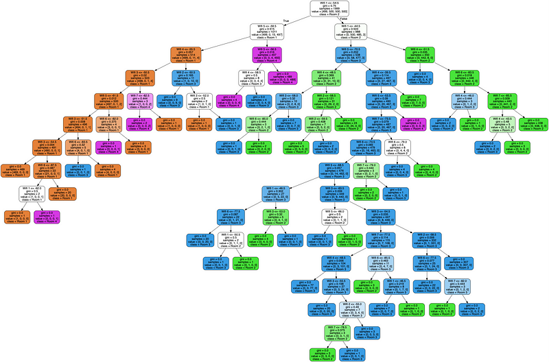

# Decision tree

## Introduction

As easy to explain as understand, the decision tree algorythm is a very popular machine learning model that can easily be associated with human decision-making process.  


## How it works 

### Construction 

A tree is a *succession of nodes*. They are three types of node :
- The root node : the first node which will be the start of the walk-through of the tree. It has the same caracteristics as the inner node
- The inner node : A node whose main goal is to separe a feature in two, and point to two new nodes.
- The leaf : The last nodes, which will only contain a value 

### Basic function

The main ideas are : 
- to divide your data into serveral distinct regions.  
For exemple one region could be people taller than 170cm and with a weight superior at 80kgs, and another will be same weight with 180cm tall, etc...
- to predict the most common label for each region at the leaf of the tree  

### Our custom decision tree function

*(For a better understanding, do not hesitate to read the model's docstrings)*  
They are two main public methods in the model : 
- the ```fit``` method : to optimize class parameters according to the input supervised dataframe  
- the ```predict``` method : To predict labels from an unlabelized dataframe

Basiquely, the ```fit``` method will create a Tree, and the ```predict``` method will traverse the tree newly created to find the most probable label.  
*** 
#### Fit method
The main idea is the following one : "With a maximum depth, it will create split of the best feature by two that separe it the best with different label."
Starting from the root node, repeat it untill the leafs:
- Select random features 
- Among them, find the "best" feature and its "threhold" (the feature the most correlated, with the value that separate the best the values by the distinct labels)
- Point to two new nodes, which will be access thanks to the node threhold for the specific feature.  

At the leaf, find the value : the most common label
### Predict method 
It is simply a walk-through of the tree, starting by the node, to predict an observation.  
For each node except the leaf :
- Compare with the observation the node's best feature and node's threhold : if the observation's value is superior than move to the right child, otherwise move to the left child.

At the leaf, return its value